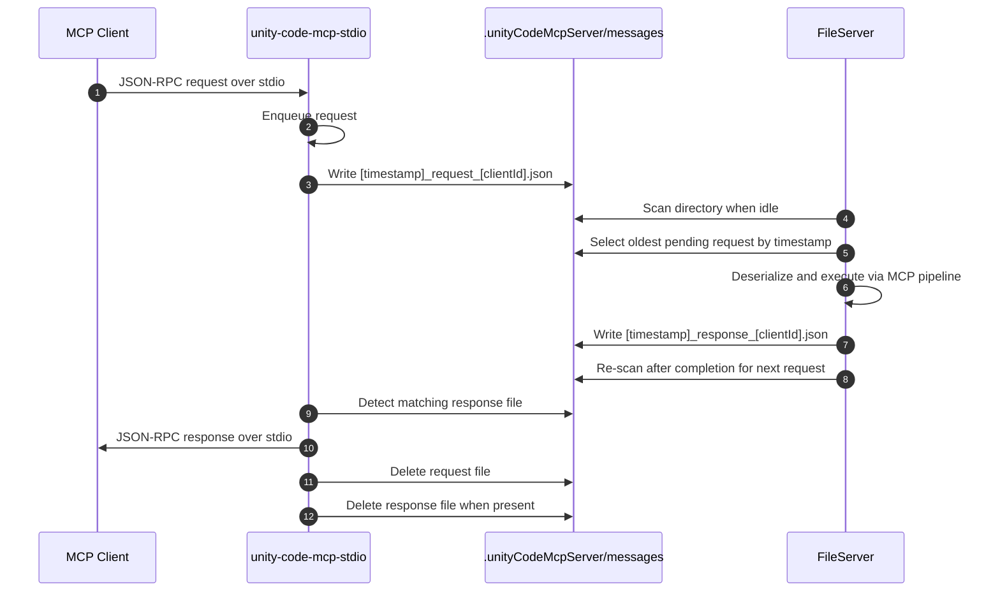
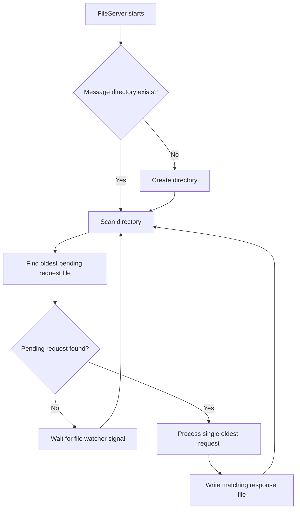
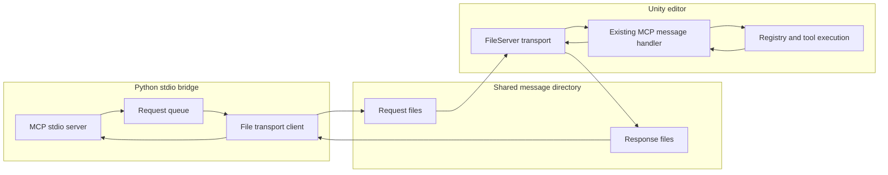

# FileServer design

## Goal

Add a file-based Unity transport that preserves the current MCP-facing behavior of the existing stdio bridge and Unity request-processing pipeline while removing the HTTP dependency between the Python bridge and the Unity editor.

The design introduces two new components:

- `FileServer` on the Unity side
- `unity-code-mcp-stdio` on the Python stdio side

This transport is intentionally scoped to MCP request and response handling. HTTP-specific concerns in the current server, such as path handling, origin checks, method validation, and SSE framing, are not part of the required parity target.

## Scope and assumptions

- The watched directory is `.unityCodeMcpServer/messages` under the Unity project root.
- Request files are named `[timestamp]_request_[clientId].json`.
- Response files are named `[timestamp]_response_[clientId].json`.
- `timestamp` uses the sortable readable format `yyyyMMddHHmmssfff`.
- `clientId` is generated by `unity-code-mcp-stdio` at startup and remains stable for the lifetime of that process.
- The file bridge default request timeout is 180 seconds.
- Only one request is actively processed by a given bridge instance at a time.
- Late orphaned response files are acceptable in the first iteration.

## Architecture

### Unity side: `FileServer`

`FileServer` owns directory setup, request discovery, ordered request processing, response file creation, and startup recovery for pending request files. It should reuse the same MCP message handling pipeline that the current Unity transport uses after transport decoding, so tool dispatch and MCP result/error formatting stay aligned with the existing system.

The Unity side should not maintain an in-memory queue of pending request files. Instead, whenever `FileServer` is idle and ready to process the next request, it should scan the message directory, select the oldest pending request by timestamp, process that single file, and then scan again. This keeps ordering correct even if new files appear while another request is still running.

When `FileServer` is idle and no pending request exists, it should wait on a file-watcher signal for new request files instead of polling on a timer. The file watcher is only a wake-up mechanism; once awakened, `FileServer` should still determine the next file by re-scanning the directory and selecting the oldest pending request.

Core responsibilities:

- Ensure the message directory exists.
- Watch for new request files.
- Discover startup leftovers that match the request-file pattern and do not already have a matching response file.
- Process requests in FIFO order based on timestamp.
- Re-scan the directory each time processing completes instead of storing a pending in-memory queue.
- Use a file watcher to wake idle processing when new files appear instead of relying on polling.
- Deserialize the request payload into the same MCP request model used by the current pipeline.
- Execute the request through the existing MCP handling path.
- Serialize either success or error output into the matching response file.
- Avoid parallel request execution inside the Unity process for this transport.

### Python side: `unity-code-mcp-stdio`

`unity-code-mcp-stdio` owns MCP-over-stdio integration, per-process client identity, request queueing, request file writing, response file waiting, timeout handling, and response forwarding back to the MCP client.

Core responsibilities:

- Start an MCP stdio server with the same outward MCP surface as `unity_code_mcp_bridge_stdio.py`.
- Generate one `clientId` at process startup.
- Queue incoming MCP requests and process them one at a time.
- Write a request file only when the bridge is ready to wait for its response.
- Wait for the matching response file for the active request.
- Return the response payload back to the MCP client over stdio.
- On timeout, return a timeout error and delete the request file.

## End-to-end flow

## Startup recovery flow

## Component boundaries

## Request file contract

The simplest first version is to store the raw JSON-RPC request body as JSON in the request file and the raw JSON-RPC response body as JSON in the response file. That keeps the file transport thin and maximizes reuse of the existing bridge and Unity message processing logic.

Implications:

- The bridge does not need a second envelope format unless future transport metadata becomes necessary.
- File name metadata handles routing and correlation.
- File contents remain close to the current stdio and HTTP payload shapes.

## Ordering and concurrency model

The design uses a conservative single-flight model on both sides.

- A bridge instance processes only one active request at a time.
- `FileServer` processes only one request at a time for this transport.
- `FileServer` never stores a pending request queue in memory.
- When `FileServer` becomes idle, it scans the directory and selects exactly one next request: the oldest pending request file by timestamp.
- If no pending request exists while idle, `FileServer` waits for a file-watcher notification instead of polling.
- If new files arrive during an in-flight request, they are naturally considered on the next scan after the current request completes.
- `clientId` prevents collisions across multiple bridge processes, while global timestamp ordering keeps the Unity side deterministic.

This model trades throughput for simplicity, recovery clarity, and easier parity with the existing bridge behavior.

## Timeout behavior

- `unity-code-mcp-stdio` starts the timeout after successfully creating the request file.
- Default timeout is 180 seconds.
- If no matching response file is observed before timeout, the bridge returns a timeout error to the MCP client.
- On timeout, the bridge deletes the request file.
- If Unity later creates a response file after the timeout, that response file may remain orphaned and is ignored in the first iteration.

## Error handling

### Bridge-side errors

- Failure to create the request directory or request file returns an MCP error immediately.
- Invalid response JSON returns an MCP error and leaves the malformed response file available for investigation.
- Timeout returns an MCP timeout-style error after request-file cleanup.

### Unity-side errors

- Invalid request file JSON produces a response file containing a serialized MCP error when possible.
- Exceptions during MCP execution produce a serialized error response file instead of failing silently.
- Startup recovery should not stop on one bad file; it should log the failure and continue scanning remaining request files.

## Implementation notes

Recommended Unity implementation slices:

1. Add a `FileServer` transport that owns directory watching and ordered file dispatch.
2. Implement stateless next-file selection by scanning the directory each time the transport becomes idle.
3. Reuse the current MCP request handling path after transport-level deserialization.
4. Add startup recovery for pending request files.
5. Use file-watcher notifications as the idle wake-up mechanism rather than a polling loop.

Recommended Python implementation slices:

1. Copy the public MCP-facing behavior of `unity_code_mcp_bridge_stdio.py`.
2. Replace HTTP request sending with file creation and response polling.
3. Keep the bridge request queue and single-flight behavior explicit.
4. Make timeout configurable, defaulting to 180 seconds.

## Validation targets

Minimum validation expected from implementation:

- Bridge writes request files with the expected naming format.
- Bridge matches only response files for its own `clientId`.
- Unity processes multiple pending request files in timestamp order.
- Unity preserves FIFO ordering even when additional request files appear while another request is still being processed.
- Unity does not depend on an in-memory pending queue to preserve ordering.
- Unity wakes from idle on file-watcher notifications rather than a poll timer.
- Success and error responses round-trip as valid JSON-RPC payloads.
- Timeout returns an MCP error and removes the request file.
- Unity startup recovery handles leftover request files without dropping them.
