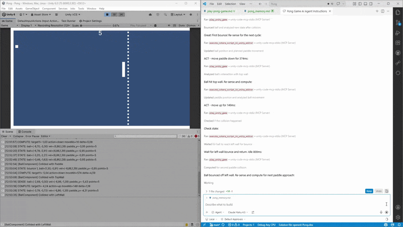
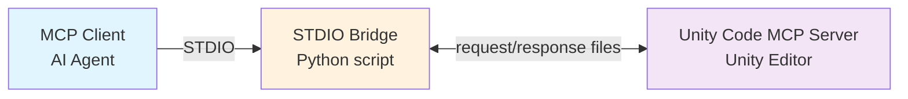

# Unity Code MCP Server

> **This is a fork of [Signal-Loop/UnityCodeMCPServer](https://github.com/Signal-Loop/UnityCodeMCPServer)** with stability and workflow improvements:
>
> - **Domain-reload resilience** — a throttled polling fallback recovers requests that the `FileSystemWatcher` misses (frequent on macOS), so requests no longer hang until you manually refresh the editor.
> - **Hands-free compilation** — incoming requests auto-trigger `AssetDatabase.Refresh()`, so scripts edited by an external agent compile without the editor needing focus (toggleable via `AutoRefreshAssetsOnRequest` in settings). While compiling, requests are deferred instead of rejected and are processed with the fresh assemblies after the reload.
> - **Stale message cleanup** — orphaned `.tmp`/request/response files left by interrupted reloads or crashed bridges are swept on server start.
> - **Vendored UniTask support** — the UPM dependency on `com.cysharp.unitask` was removed; any UniTask in the project (UPM package or a source copy in `Assets`) satisfies the by-name asmdef reference.
> - **`--project-root` bridge option** — run the STDIO bridge from any location, not just inside the Unity project.
> - **New agent skill: `building-unity-ui-from-html`** — a full workflow for faithfully converting HTML/CSS UI prototypes into uGUI, with a CSS-to-uGUI mapping reference and a rect-dump + screenshot verification loop.
> - Removed an unused vendored `Unity.EditorCoroutines.Editor.dll` that collided with the official `com.unity.editorcoroutines` package.

### Search the live Unity project
Inspect active scenes, components, assets, console output, settings, Play Mode state, and runtime values from an MCP client.
### Execute directly inside the Editor
Create and modify GameObjects, prefabs, ScriptableObjects, import settings, and other Unity assets by executing C# in the Editor.
### Verify with runtime feedback
Run Edit Mode and Play Mode tests, enter Play Mode, simulate player input, capture screenshots, read Unity console logs, and inspect live game state after actions.
<br/>

*Example agent workflow: Play Pong in a closed loop by using `enter_play_mode`, `execute_csharp_script_in_unity_editor`, `play_unity_game`, and `read_unity_console_logs` to search runtime state, execute input actions, verify the result, and adapt the next move.*
<br/>


## Real workflow example

See [the full cities workflow example and transcript](Assets/Plugins/UnityCodeMcpServer/Documentation~/Examples/UsageExample_CitiesWorkflow.md).

## Table of contents

- [Tools](#tools)
- [Security considerations](#security-considerations)
- [Architecture](#architecture)
- [Quick start](#quick-start)
- [Built-in tools](#built-in-tools)
- [Agent skills](#agent-skills)
- [Extending (adding tools)](#extending-adding-tools)
- [Script execution context](#script-execution-context)
- [STDIO bridge](#stdio-bridge)
- [Testing](#testing)
- [Known Issues](#known-issues)
- [License](#license)


## Tools

#### execute_csharp_script_in_unity_editor

Perform any task by executing generated C# scripts in Unity Editor context. Full access to UnityEngine, UnityEditor APIs, and reflection. Automatically captures logs, errors, and return values.

#### read_unity_console_logs

Read Unity Editor Console logs with configurable entry limits (1-1000, default 200)

#### run_unity_tests

Run Unity tests via TestRunnerApi. Supports EditMode, PlayMode, or both. Can run all tests or filter by fully qualified test names.

#### enter_play_mode

Enter Unity Play Mode, pause time and return immediately after triggering the transition. Intended to be used before gameplay automation tools.

#### play_unity_game

Temporarily unpause time, simulate configured Input System actions, collect logs, and pause again when finished.

#### get_unity_game_view_window_screenshot

Capture the current Unity Game View as an image without routing screenshot capture through gameplay input calls.

#### exit_play_mode

Exit Unity Play Mode, unpause time, and return immediately after triggering the transition.

#### get_unity_info

Returns information about the current Unity Editor project and the UnityCodeMcpServer settings.

## Security considerations

This package executes LLM-generated C# code (including reflection code) with the same privileges as the Unity Editor process.

Recommendations:

- Review scripts before executing them.
- Use a separate Unity project and/or run Unity in an isolated environment (VM/container).

You are responsible for securing your environment and for any changes or data loss caused by executed scripts.

## Architecture

<br/>
*Architecture diagram: The Unity Code MCP Server package runs inside the Unity Editor and communicates with an external MCP client (like an LLM agent) through a file-backed STDIO bridge.*

### STDIO Transport



## Quick start

### Requirements

- Unity 2022.3 LTS or higher (tested on 2022.3.62f3 and 6000.2.7f2)
- UniTask (async/await integration): https://github.com/Cysharp/UniTask
- `uv` (Python package manager) for the bundled STDIO bridge: https://docs.astral.sh/uv/.

### Installation

1. Install `uv`:
   - Follow instructions at https://docs.astral.sh/uv/getting-started/installation
2. Install UniTask in your Unity project (skip this step if your project already contains UniTask, e.g. a source copy under `Assets` — the asmdef references it by name, so any copy works). Open **Window > Package Manager**, click the **+** button, select **Add package from git URL...**, and enter:

```
https://github.com/Cysharp/UniTask.git?path=src/UniTask/Assets/Plugins/UniTask
```

3. Install Unity Code MCP Server from Unity Package Manager. Open **Window > Package Manager**, click the **+** button, select **Add package from git URL...**, and enter:

```
https://github.com/zamgune/UnityCodeMCPServer.git?path=Assets/Plugins/UnityCodeMcpServer
```

   To pull the latest changes later, select the package in Package Manager and press **Update** (the commit hash is pinned in `Packages/packages-lock.json`).

4. Configure the skill install location. Open **Tools/UnityCodeMcpServer/Show or Create Settings**, scroll to the **Skills** section, and confirm or change the install directory. By default, first-time installs target `.agents/skills/`. Skills are installed and updated automatically when the package is installed or updated.

### First Run

### MCP client configuration

1. Open your Unity project. Unity auto-starts the file-backed transport and watches `.unityCodeMcpServer/messages` in the project root.
2. Configure your MCP client to run the bundled STDIO bridge.

#### STDIO

Example configuration (using `uv` to run the bridge):

The `unity-code-mcp-stdio` bridge forwards STDIO traffic to Unity through `.unityCodeMcpServer/messages`.

When installed via Package Manager, the bridge is automatically copied (and kept in sync on every package update) to `Assets/Plugins/UnityCodeMcpServer/Editor/STDIO~` in your project, so point your MCP client there:

```json
{
  "servers": {
    "unity-code-mcp-stdio": {
      "command": "uv",
      "args": [
        "run",
        "--directory",
        "C:/path/to/UnityProject/Assets/Plugins/UnityCodeMcpServer/Editor/STDIO~",
        "unity-code-mcp-stdio"
      ]
    }
  }
}
```

To run the bridge from a location outside the Unity project (e.g. a shared checkout), pass the project explicitly:

```
unity-code-mcp-stdio --project-root /path/to/UnityProject
```

### Server configuration (Unity)

1. Access the settings via **Tools/UnityCodeMcpServer/Show or Create Settings**.
2. Configure **Verbose Logging** for detailed diagnostics and optionally set **Input Actions Asset** for `play_unity_game`.

The file-backed transport exchanges request and response files through `.unityCodeMcpServer/messages` in the Unity project root.

#### Reliability settings (fork additions)

Both default to **on**; a fresh install gets the correct defaults automatically.

- **Auto Refresh Assets On Request** (`AutoRefreshAssetsOnRequest`) — refreshes the AssetDatabase when a request arrives so externally edited scripts compile without the editor needing focus.
- **Run In Background During Play Mode** (`RunInBackgroundDuringPlayMode`) — sets `Application.runInBackground` on entering Play Mode so requests from an unfocused editor (e.g. an agent in a terminal) are serviced instead of hanging. Runtime-only; does not change PlayerSettings or builds.

> **Upgrading from an older version?** A settings asset created before these fields existed deserializes the missing booleans to `false`, silently disabling the features. Open the settings and confirm both toggles are on (or add `AutoRefreshAssetsOnRequest: 1` and `RunInBackgroundDuringPlayMode: 1` to the `.asset` directly). Fresh installs are unaffected.

#### Using two Unity projects at once

The transport is fully project-isolated (each editor watches its own `.unityCodeMcpServer/messages`, each bridge resolves its own project root), so multiple editors can run simultaneously. The one thing to make unique is the **MCP server name** in each client config — if both projects register a server under the same name, the client cannot tell them apart and routes everything to one bridge. Give each project a distinct name, e.g. `unity-projectA` / `unity-projectB`, and run a separate agent session per project.

### Menu commands

#### General

- **Tools/UnityCodeMcpServer/Show or Create Settings** — Open the server settings asset in the inspector


## Agent skills

Unity Code MCP Server ships a set of **AI agent skill files** (Markdown documents that teach your agent how to use the server's tools effectively). These skills are installed automatically into the configured target directory whenever the package is installed or updated.

Bundled skills:

- `executing-csharp-scripts-in-unity-editor` — patterns for safe, effective C# script execution
- `unity-game-player` — closed-loop autonomous game playing (sense → compute → act)
- `building-unity-ui-from-html` — convert HTML/CSS UI prototypes into faithful uGUI implementations (fork addition)

### Installing skills

1. Open the server settings: **Tools/UnityCodeMcpServer/Show or Create Settings**.
2. Scroll to the **Skills** section.
3. Choose the install directory from the dropdown:

- `GitHub` targets `.github/skills/`
- `Claude` targets `.claude/skills/`
- `Agents` targets `.agents/skills/`
- `Custom` shows a folder picker so you can select any directory

4. The inspector shows the currently selected target directory label so you can verify exactly where skills will be copied.
5. Package install and update runs copy the skills automatically.

Only new or changed `.md` files are copied. Files that are already up to date (matching content hash) are skipped.

### Included skills

| Skill                                      | Description                                                                                                                                                                                                                                                                          |
| ------------------------------------------ | ------------------------------------------------------------------------------------------------------------------------------------------------------------------------------------------------------------------------------------------------------------------------------------ |
| `executing-csharp-scripts-in-unity-editor` | Teaches the agent when and how to use `execute_csharp_script_in_unity_editor`, `read_unity_console_logs`, and `run_unity_tests` together as a reliable pipeline. Covers forbidden patterns, debugging loops, and common scripting patterns.                                          |
| `unity-game-player`                        | Teaches the agent how to play and test Unity games in a closed loop using `enter_play_mode`, `play_unity_game`, `execute_csharp_script_in_unity_editor`, `read_unity_console_logs`, and `exit_play_mode`. Covers scene discovery, math-based action timing, and adaptive re-sensing. |

## Extending (adding tools)

Add Tools, Prompts, Resources, or Async Tools by implementing the relevant interfaces (ITool, IToolAsync, IPrompt, IResource) anywhere in your codebase. The server will automatically detect and register them.

### Synchronous tool

```csharp
using System.Collections.Generic;
using System.Text.Json;
using UnityCodeMcpServer.Interfaces;
using UnityCodeMcpServer.Protocol;

public class EchoTool : ITool
{
    public string Name => "echo";

    public string Description => "Echoes the input text back to the caller";

    public JsonElement InputSchema => JsonHelper.ParseElement(@"{
            ""type"": ""object"",
            ""properties"": {
                ""text"": {
                    ""type"": ""string"",
                    ""description"": ""The text to echo""
                }
            },
            ""required"": [""text""]
        }");

    public ToolsCallResult Execute(JsonElement arguments)
    {
        var text = arguments.GetStringOrDefault("text", "");

        return ToolsCallResult.TextResult($"Echo: {text}");
    }
}
```

### Asynchronous tool

```csharp
using System.Collections.Generic;
using System.Text.Json;
using UnityCodeMcpServer.Interfaces;
using UnityCodeMcpServer.Protocol;
using Cysharp.Threading.Tasks;

public class DelayedEchoTool : IToolAsync
{
    public string Name => "delayed_echo";

    public string Description => "Echoes the input text after a specified delay (demonstrates async tool)";

    public JsonElement InputSchema => JsonHelper.ParseElement(@"{
            ""type"": ""object"",
            ""properties"": {
                ""text"": {
                    ""type"": ""string"",
                    ""description"": ""The text to echo""
                },
                ""delayMs"": {
                    ""type"": ""integer"",
                    ""description"": ""Delay in milliseconds before echoing"",
                    ""default"": 1000
                }
            },
            ""required"": [""text""]
        }");

    public async UniTask<ToolsCallResult> ExecuteAsync(JsonElement arguments)
    {
        var text = arguments.GetStringOrDefault("text", "");
        var delayMs = arguments.GetIntOrDefault("delayMs", 1000);

        await UniTask.Delay(delayMs);

        return ToolsCallResult.TextResult($"Delayed Echo (after {delayMs}ms): {text}");
    }
}
```

## Script execution context

By default, script execution context includes following assemblies:

- Assembly-CSharp
- Assembly-CSharp-Editor
- System.Core
- UnityEngine.CoreModule
- UnityEditor.CoreModule

Unity Code MCP Server settings (Assets/Plugins/UnityCodeMcpServer/Editor/Resources/UnityCodeMcpServerSettings.asset) allow configuring additional assemblies to include in the script execution context. This is useful if your project has assemblies that your generated scripts need to reference.

To add additional assemblies use settings 'Additional Assemblies' section.


## STDIO bridge

See the bridge docs at [README_STDIO.md](README_STDIO.md).

## Testing

Unity tests are in `Assets/Tests/` and can be run via the Unity Test Runner.

## Known Issues

### GUID conflicts with existing dll files in the project

- Unity Code MCP Server includes dll files in its package. If those files are already present in your project, you may see GUID conflicts. In our test cases it does not cause any issues, but if you encounter problems, please fill issue: [Issues](https://github.com/Signal-Loop/UnityCodeMCPServer/issues). Removing duplicate dlls from your project may resolve the conflicts.

```
GUID [eb9c83041c7a89c46bb6e20eab4484df] for asset 'Packages/com.signal-loop.unitycodemcpserver/Editor/Bin/Microsoft.CodeAnalysis.CSharp.dll' conflicts with:
  '[Path to dll file in your project]/Microsoft.CodeAnalysis.CSharp.dll' (current owner)
We can't assign a new GUID because the asset is in an immutable folder. The asset will be ignored.
```

## License

MIT
