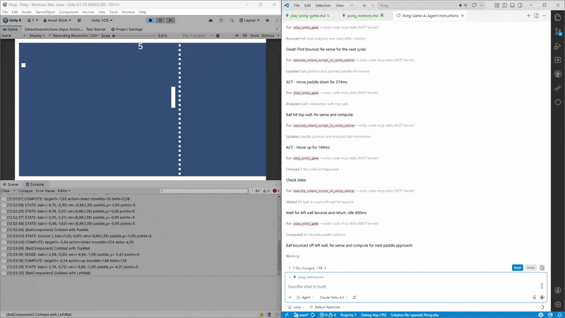

# Unity Code MCP Server

Give an AI agent full control of the Unity Editor over MCP: search the live project, execute C# inside the Editor, run tests, drive Play Mode, and read the console — all in a closed loop.

- **Search the live project** — scenes, components, assets, console output, settings, Play Mode state, runtime values.
- **Execute inside the Editor** — create/modify GameObjects, prefabs, ScriptableObjects, import settings, and any other asset by running C#.
- **Verify with runtime feedback** — Edit/Play Mode tests, simulated input, screenshots, console logs, live state inspection.

*Example: playing Pong in a closed loop with `enter_play_mode`, `execute_csharp_script_in_unity_editor`, `play_unity_game`, and `read_unity_console_logs`.*


---

## Agent setup (copy-paste)

The fastest way to install: paste the block below into **Claude Code** or **Codex** running in your Unity project, replacing `<PROJECT_ROOT>` with the absolute path to the project (the folder containing `Assets/`). The agent installs the package and registers the MCP server for you.

````text
Set up the Unity Code MCP Server for the Unity project at <PROJECT_ROOT> and register it with your MCP client.

1. Verify `uv` is installed: run `uv --version`. If missing, install it from
   https://docs.astral.sh/uv/getting-started/installation and re-check.

2. Add these dependencies to <PROJECT_ROOT>/Packages/manifest.json under "dependencies"
   (keep all existing entries; skip the UniTask line if the project already has UniTask):
     "com.cysharp.unitask": "https://github.com/Cysharp/UniTask.git?path=src/UniTask/Assets/Plugins/UniTask",
     "com.signal-loop.unitycodemcpserver": "https://github.com/zamgune/UnityCodeMCPServer.git?path=Assets/Plugins/UnityCodeMcpServer"

3. Ask me to open the project in Unity once so it resolves the packages and copies the stdio
   bridge to <PROJECT_ROOT>/Assets/Plugins/UnityCodeMcpServer/Editor/STDIO~ . Wait for that.

4. Register the bridge as an MCP server using a name unique to this project (e.g. unity_<folder>).
   Let STDIO_DIR = <PROJECT_ROOT>/Assets/Plugins/UnityCodeMcpServer/Editor/STDIO~
   - If you are Claude Code, run:
       claude mcp add unity_<folder> -s local -- uv run --directory "STDIO_DIR" unity-code-mcp-stdio --request-timeout 240
   - If you are Codex, add this to ~/.codex/config.toml:
       [mcp_servers.unity_<folder>]
       command = "uv"
       args = ["run", "--directory", "STDIO_DIR", "unity-code-mcp-stdio", "--request-timeout", "240"]
       startup_timeout_sec = 60
       tool_timeout_sec = 300

5. Restart the MCP client and confirm the unity_<folder> server connects. With Unity open, its
   tools (execute_csharp_script_in_unity_editor, run_unity_tests, read_unity_console_logs, ...)
   should be listed.

IMPORTANT: the client's per-tool MCP timeout must be >= the bridge --request-timeout (240s).
Codex's tool_timeout_sec defaults to 60s and MUST be raised, or a domain-reload/recompile call
aborts before Unity answers. Claude Code has no such low cap.
````

> It registers as a **local stdio** MCP server, not a remote "Connector" (those are HTTP/SSE URLs) — so it won't appear in any Connector list. That's expected.

---

## Manual setup

**Requirements**

- Unity 2022.3 LTS or higher (tested on 2022.3.62f3 and 6000.2.7f2)
- [`uv`](https://docs.astral.sh/uv/) — runs the bundled Python stdio bridge
- [UniTask](https://github.com/Cysharp/UniTask) — referenced by name, so any copy in the project works

**1. Install the package.** In **Window > Package Manager > + > Add package from git URL**, add UniTask (skip if already present), then this package:

```
https://github.com/Cysharp/UniTask.git?path=src/UniTask/Assets/Plugins/UniTask
https://github.com/zamgune/UnityCodeMCPServer.git?path=Assets/Plugins/UnityCodeMcpServer
```

Opening the project copies the stdio bridge to `Assets/Plugins/UnityCodeMcpServer/Editor/STDIO~` (kept in sync on every package update) and installs the agent skills.

**2. Register the bridge** with your MCP client, pointing at that `STDIO~` directory. Generic JSON form:

```json
{
  "command": "uv",
  "args": ["run", "--directory", "<PROJECT>/Assets/Plugins/UnityCodeMcpServer/Editor/STDIO~", "unity-code-mcp-stdio", "--request-timeout", "240"]
}
```

To run the bridge from outside the project, pass `--project-root /path/to/UnityProject`.

### Timeouts (read this if calls time out)

During a recompile/domain reload the bridge **defers** the request and answers it after the fresh assemblies load — a single call can legitimately block for the whole reload. Keep the **client's per-tool timeout ≥ the bridge `--request-timeout`**. Codex's `tool_timeout_sec` defaults to 60s (too low) — set `tool_timeout_sec = 300` and `startup_timeout_sec = 60` in its `[mcp_servers.*]` block.

### Cross-platform (one committed config for macOS + Windows)

The absolute `--directory` path differs per machine, but the part *below the project root* is identical everywhere. To keep a single committed config that works on both OSes, make the bridge path **project-relative** instead of absolute:

- **Claude Code** — commit a project `.mcp.json` and use the `${CLAUDE_PROJECT_DIR:-.}` placeholder (Claude Code injects `CLAUDE_PROJECT_DIR` = project root into the server's environment):

  ```json
  {
    "mcpServers": {
      "unity": {
        "command": "uv",
        "args": ["run", "--directory", "${CLAUDE_PROJECT_DIR:-.}/Assets/Plugins/UnityCodeMcpServer/Editor/STDIO~", "unity-code-mcp-stdio", "--request-timeout", "240"]
      }
    }
  }
  ```

  Editing `.mcp.json` requires re-approving the server once per machine in the `claude` TUI. (If your Unity project lives in a subfolder, prefix the relative path with it, e.g. `${CLAUDE_PROJECT_DIR:-.}/MyUnityApp/Assets/...`.)

- **Codex** — `config.toml` does **not** expand variables in `args`, so use a **relative** `--directory` (resolved from the project root Codex launches in):

  ```toml
  [mcp_servers.unity]
  command = "uv"
  args = ["run", "--directory", "Assets/Plugins/UnityCodeMcpServer/Editor/STDIO~", "unity-code-mcp-stdio", "--request-timeout", "240"]
  startup_timeout_sec = 60
  tool_timeout_sec = 300
  ```

  Forward slashes work on Windows too. Alternatively, register Codex servers in the per-machine `~/.codex/config.toml` with an absolute path — that file isn't shared across machines, so it sidesteps the problem.

### Using two projects at once

The transport is fully project-isolated, so multiple editors can run at once. Give each project a **distinct MCP server name** (e.g. `unity_projectA` / `unity_projectB`); a shared name routes everything to one bridge.

### In-Editor Setup & Status panel

Open **Tools/UnityCodeMcpServer/Show or Create Settings** (it also opens automatically the first time the package is installed). The **Setup & Status** section at the top shows whether the server is listening (`Running`/`Stopped`, with a **Restart** button) and when a client last sent a request — the in-Unity confirmation that the transport works. It also gives **copy-ready config** for **Claude Code**, **Codex**, and a **generic JSON** client, each pre-filled with this machine's resolved `STDIO~` path so you don't have to assemble the absolute path by hand.

### Reliability settings (Unity)

Open **Tools/UnityCodeMcpServer/Show or Create Settings**. Both default **on**:

- **Auto Refresh Assets On Request** — externally edited scripts compile without the editor needing focus.
- **Run In Background During Play Mode** — services requests from an unfocused editor in Play Mode (runtime-only; does not change builds).

> **Upgrading?** A settings asset created before these fields existed deserializes them to `false`. Open the settings and confirm both toggles are on.

---

## Tools

| Tool | Purpose |
| --- | --- |
| `execute_csharp_script_in_unity_editor` | Run generated C# in the Editor (full UnityEngine/UnityEditor + reflection). Captures logs, errors, and return value. |
| `read_unity_console_logs` | Read Console logs (1–1000 entries, default 200). |
| `run_unity_tests` | Run EditMode/PlayMode tests via TestRunnerApi; all or filtered by name. |
| `enter_play_mode` / `exit_play_mode` | Enter/exit Play Mode (pauses time, returns immediately). |
| `play_unity_game` | Unpause, simulate Input System actions, collect logs, pause again. |
| `get_unity_game_view_window_screenshot` | Capture the Game View as an image. |
| `get_unity_info` | Report current project and server settings. |

## Agent skills

Markdown skills that teach an agent to use the tools well. Installed/updated automatically into the configured directory (`.agents/skills/`, `.claude/skills/`, `.github/skills/`, or custom — set under the **Skills** section of the settings).

- `executing-csharp-scripts-in-unity-editor` — safe, effective script execution; debugging loops; **domain-reload timing discipline**.
- `unity-game-player` — closed-loop autonomous game playing (sense → compute → act).
- `building-unity-ui-from-html` — convert HTML/CSS prototypes into faithful uGUI.

## Security

This package executes LLM-generated C# (including reflection) with the Unity Editor's privileges. Review scripts before running, prefer an isolated project/VM, and note that you are responsible for any resulting changes or data loss.

## Extending

Implement `ITool`, `IToolAsync`, `IPrompt`, or `IResource` anywhere in your codebase; the server auto-discovers and registers them. Minimal example:

```csharp
public class EchoTool : ITool
{
    public string Name => "echo";
    public string Description => "Echoes the input text back to the caller";
    public JsonElement InputSchema => JsonHelper.ParseElement(
        @"{ ""type"":""object"", ""properties"":{ ""text"":{ ""type"":""string"" } }, ""required"":[""text""] }");

    public ToolsCallResult Execute(JsonElement arguments) =>
        ToolsCallResult.TextResult($"Echo: {arguments.GetStringOrDefault("text", "")}");
}
```

For async tools return `UniTask<ToolsCallResult>` from `IToolAsync.ExecuteAsync`. To expand the script execution context, add assembly names under **Additional Assemblies** in the settings.

## More docs

- Architecture and the stdio bridge: [README_STDIO.md](README_STDIO.md)
- Full workflow example: [cities workflow + transcript](Assets/Plugins/UnityCodeMcpServer/Documentation~/Examples/UsageExample_CitiesWorkflow.md)
- Release notes: [`Dev/Releases/`](Dev/Releases/)

## Known issues

**GUID conflicts with existing DLLs** — the package bundles Roslyn/`System.Text.Json` DLLs. If your project already contains them you may see GUID conflict warnings; they are usually harmless. Remove the duplicate DLLs if they cause problems, or open an [issue](https://github.com/Signal-Loop/UnityCodeMCPServer/issues).

## License

MIT — fork of [Signal-Loop/UnityCodeMCPServer](https://github.com/Signal-Loop/UnityCodeMCPServer).
