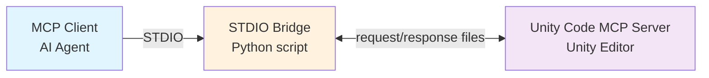
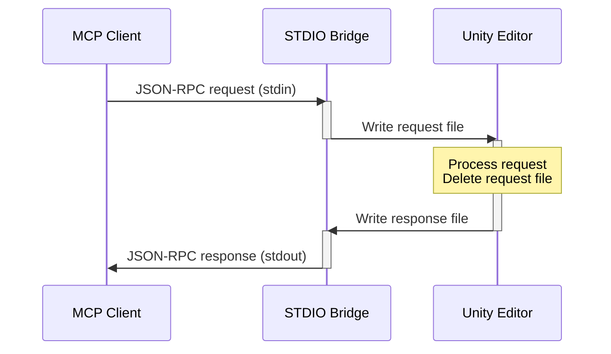

# Unity Code MCP STDIO Bridge

A Python package that bridges MCP (Model Context Protocol) over STDIO to Unity's file-backed transport.

## Overview

This bridge enables MCP clients to communicate with UnityCodeMcpServer running inside the Unity Editor through `.unityCodeMcpServer/messages`. It:

1. Receives MCP messages via STDIO
2. Writes them to Unity request files
3. Returns responses back via STDIO

## Prerequisites

- **Python 3.10+** - Required for the bridge
- **uv** - Fast Python package manager ([install uv](https://docs.astral.sh/uv/getting-started/installation/))
- **Unity Editor** - With UnityCodeMcpServer running (auto-starts when Unity opens)

### Installing uv

**Windows (PowerShell):**

```powershell
powershell -ExecutionPolicy ByPass -c "irm https://astral.sh/uv/install.ps1 | iex"
```

**macOS/Linux:**

```bash
curl -LsSf https://astral.sh/uv/install.sh | sh
```

## Installation

### Using uv (Recommended)

No installation step is required. Run the packaged bridge directly:

```bash
uv run --directory /path/to/STDIO~ unity-code-mcp-stdio
```

### Using pip (Alternative)

```bash
pip install -e /path/to/STDIO~
unity-code-mcp-stdio
```

## Usage

### Command Line Arguments

| Argument            | Default | Description                                                     |
| ------------------- | ------- | --------------------------------------------------------------- |
| `--request-timeout` | `180`   | Seconds to wait for a Unity response file before failing        |

> **Note:** The bridge resolves the Unity project root automatically from the packaged `STDIO~` folder.

### Examples

```bash
# Basic usage (from STDIO directory)
uv run unity-code-mcp-stdio

# Run from any directory using --directory
uv run --directory "C:/path/to/STDIO~" unity-code-mcp-stdio

# Allow slower Unity operations before the bridge times out a stalled request
uv run --directory "C:/path/to/STDIO~" unity-code-mcp-stdio --request-timeout 240
```

## MCP Configuration

```json
{
  "mcpServers": {
    "unity": {
      "command": "uv",
      "args": [
        "run",
        "--directory",
        "C:/Users/YOUR_USERNAME/path/to/Assets/Plugins/UnityCodeMcpServer/Editor/STDIO~",
        "unity-code-mcp-stdio"
      ]
    }
  }
}
```

> **Note:** Replace `C:/Users/YOUR_USERNAME/path/to/...` with the actual path to your Unity project's STDIO folder.

## Architecture



### Communication Flow



**Request/Response Handling:**

1. **MCP Client → Bridge (STDIO):** MCP Client sends JSON-RPC 2.0 messages via stdin
2. **Bridge → Unity (files):** Bridge writes a request file to `.unityCodeMcpServer/messages`
3. **Unity → Bridge (files):** Unity claims the request by reading and deleting the request file, then writes a matching response file
4. **Bridge → MCP Client (STDIO):** Bridge writes the response to stdout

The bridge only waits for the matching response file. If Unity does not produce it before the timeout expires, the bridge returns an actionable error and removes the pending request file if it is still present.

## Logging

The bridge writes diagnostics to `src/unity_code_mcp_stdio/unity-code-mcp-stdio.log` next to the Python entrypoint. Logging stays file-only so stdout remains clean for JSON-RPC traffic.

Each request records enough context to trace failures across the transport boundary:

- A bridge-local trace id for every forwarded Unity request
- The JSON-RPC request id and method
- Tool name, URI, and argument key summary when present
- File request creation, response wait, response handling, shutdown, and closed-stream events
- Request duration, response summary, and error type/message on failure
- Timeout details when a request stalls or fails
- The last stdin line preview or last stdout message preview when framing breaks

Log retention uses size-based rotation:

- Active log file: `unity-code-mcp-stdio.log`
- Maximum size per file: 5 MB
- Retained rotated files: 3 backups
- Maximum on-disk footprint: about 20 MB including the active file

## Development

### Running Tests

```bash
cd /path/to/STDIO~

uv run --extra dev pytest tests/
```

> **Windows Note:** If you encounter "Failed to canonicalize script path" errors with `uv run`, use the venv Python directly as shown below.

```
# Use the venv Python directly (avoids uv script canonicalization issues):
.\.venv\Scripts\python.exe -m pytest tests/ -v
```

### Development Install

```bash
# Sync dependencies including dev extras
uv sync --extra dev

# Alternative: pip install
uv pip install -e ".[dev]"
```

## Testing with Postman

Postman supports MCP (Model Context Protocol) natively, including STDIO transport. You can use Postman to test and debug the STDIO Bridge.

### Prerequisites

- **Postman Desktop App** (v11.35+) - [Download here](https://www.postman.com/downloads/)
- **Unity Editor** running with UnityCodeMcpServer active

### Step-by-Step Guide

1. **Open Postman** and create or select a workspace

2. **Create a new MCP request:**
   - Click **New** → **MCP**
   - Select **STDIO** as the transport type

3. **Configure the STDIO command:**

   ```
  uv run --directory "C:/Users/YOUR_USERNAME/path/to/Assets/Plugins/UnityCodeMcpServer/Editor/STDIO~" unity-code-mcp-stdio
   ```

   > **Tip:** You can also paste JSON configuration directly:
   >
   > ```json
   > {
   >   "command": "uv",
   >   "args": [
   >     "run",
   >     "--directory",
   >     "C:/Users/YOUR_USERNAME/path/to/Assets/Plugins/UnityCodeMcpServer/Editor/STDIO~",
   >     "unity-code-mcp-stdio"
   >   ]
   > }
   > ```

4. **Click "Connect"** - Postman will connect and discover available tools, prompts, and resources

### Reference

For more details, see the official Postman documentation:

- [Create MCP Requests](https://learning.postman.com/docs/postman-ai-developer-tools/mcp-requests/create/)
- [MCP Server Catalog](https://www.postman.com/explore/mcp-servers)

## License

MIT
