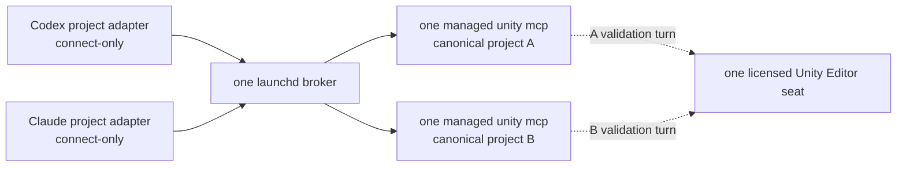
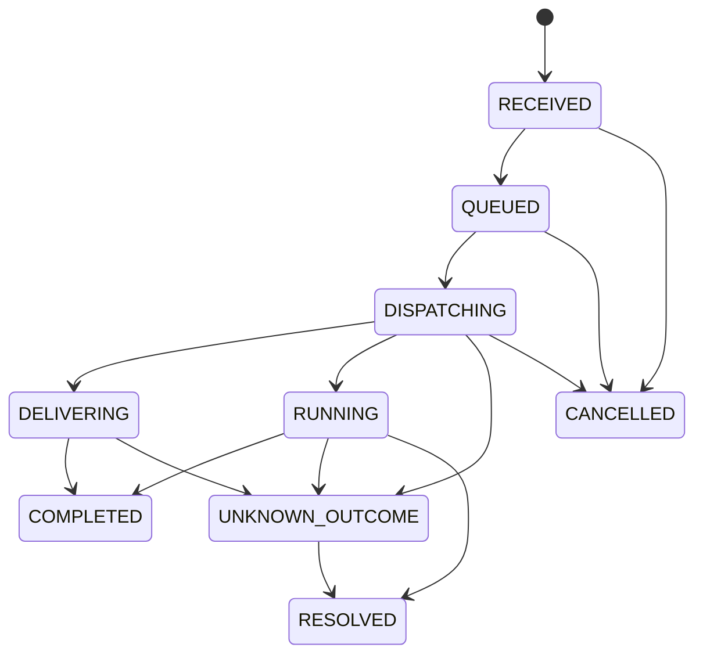

# unity-mcp-router v2

macOS에서 Codex, Claude Code와 여러 Unity 프로젝트가 공식 `unity mcp`를 안전하게 공유하도록 만드는 machine-wide broker다. MCP 클라이언트마다 얇은 stdio adapter는 하나씩 생기지만, broker 프로세스는 `launchd`가 하나만 소유하고 공식 Unity CLI child는 canonical project마다 최대 하나만 소유한다.

현재 `2.0.0-dev`는 아직 태그가 없는 개발 빌드다. 2026-08-03에 완료한 설치, 5-project canary, 60분 single-Editor/two-client soak와 실제 rollback 결과는 [검증 기록](docs/VALIDATION-2026-08-03.md)에 고정했다. 그 기록은 two-Editor 동시 사용을 승인하지 않는다.

> 2026-08-03 이 Mac은 `/Users/zamgune/.unity/bin/unity`의 exact `1.0.0-beta.3`을 사용한다. candidate의 내장 `unity upgrade --changelog`에는 Editor script recompile 뒤 `unity mcp`가 영구적으로 끊기는 문제와 failed eval false-success 수정이 명시돼 있다. Unity CLI 자체도 공식 문서상 experimental이므로 자동으로 latest를 추종하지 않고 beta.3 이상을 설치·canary gate로 둔다. [Unity CLI 사용·업데이트](https://docs.unity.com/en-us/unity-cli/use-unity-cli)

## 운영 구조



핵심 불변식은 다음과 같다.

- broker는 `launchd`만 시작한다. 설치된 adapter는 모두 `--broker-mode connect-only`라서 두 번째 broker를 자동 생성하지 않는다.
- 각 프로젝트는 설치 시 `realpath`와 filesystem `dev/inode`로 식별해 immutable prepared config에 고정한다. 설치된 broker/adapter/admin은 시작할 때 외장 프로젝트 경로를 직접 조회하지 않는다. 같은 physical checkout의 alias는 하나로 합치고, 같은 checkout에 서로 다른 `unityBin/extraArgs` profile이 들어오면 시작을 거부한다.
- 서로 다른 repository의 source 편집은 병행할 수 있지만 같은 repository의 동시 writer는 agent/Git coordination으로 금지한다. Unity import/recompile/test/build validation turn과 heavy 작업은 기본값에서 machine-wide로 하나씩만 허용한다.
- mutation은 Unity에 전달된 뒤 timeout, 연결 단절 또는 취소가 발생해도 자동 재전송하지 않는다. 결과를 알 수 없으면 `UNKNOWN_OUTCOME`로 journal에 남기고 해당 프로젝트의 mutation을 차단한다.
- Codex/Claude 연결 종료는 다른 client나 shared Unity child를 종료하지 않는다.
- raw `unity mcp`, legacy adapter, 두 번째 broker, 동일 프로젝트의 중복 Editor, license capacity 초과 Editor는 process audit에서 검출하며 기본 설정은 dispatch를 차단한다.

## 필수 조건

1. Node.js 20 이상. live install에는 실행 파일의 정확한 SHA-256을 함께 전달해야 한다. 입력 Node는 symlink/hardlink가 아닌 단일 regular executable이어야 하며, macOS에서는 `/usr/lib`와 `/System/Library` 밖의 동적 라이브러리에 의존하지 않는 self-contained binary여야 한다. installer는 검증한 바이트를 `~/.unity-mcp-router/runtimes/<sha256>/node`로 복사하고 이후 LaunchAgent와 stable wrapper는 이 local managed runtime만 실행한다. 외장 볼륨의 입력 경로는 설치 시 검증·복사에만 사용하며 LaunchAgent runtime dependency로 남기지 않는다.
2. Unity CLI `1.0.0-beta.3` 이상. 아래 결과가 gate다.

   ```sh
   /Users/zamgune/.unity/bin/unity --version
   /Users/zamgune/.unity/bin/unity upgrade --check
   /Users/zamgune/.unity/bin/unity upgrade --changelog
   ```

3. LaunchAgent가 사용하는 exact managed Node (`~/.unity-mcp-router/runtimes/<sha256>/node`)에 macOS의 이동식 볼륨 접근을 허용해야 한다. Node SHA가 바뀌면 실행 경로도 바뀌므로 새 경로를 다시 승인하고 `unity-mcp-router-admin doctor`를 통과시킨다. broker는 Unity child를 만들기 전에 별도 process에서 각 project의 `Assets`와 `ProjectSettings`, 설치 시 고정한 exact `dev/inode`를 최대 3초만 검사한다. 권한 팝업이나 볼륨 정지는 `PROJECT_ACCESS_PROBE_TIMEOUT`, 같은 경로의 교체·오마운트는 `PROJECT_IDENTITY_MISMATCH`로 fail-closed하며 broker 자체와 status/doctor는 계속 응답한다.
4. 각 프로젝트에는 고정된 `com.unity.pipeline` 및 lock stanza와 호환되는 audited embedded compatibility snapshot이 설치되어 있어야 한다. `manual-close`는 Pipeline `editor_status` fallback을 지원하므로 5개 snapshot의 동일 버전 동기화가 선행조건은 아니다. 동일한 승인 handoff package로의 동기화는 `typed-auto-close`의 별도 gate다. single-seat handoff는 선택된 한 Editor만 해당 canonical 절대 경로로 열고 Unity CLI `--project-path` routing을 사용한다. `--instance`는 제거됐다. [Unity CLI reference](https://docs.unity.com/en-us/unity-cli/unity-cli-reference), [Unity Pipeline package](https://docs.unity.com/en-us/unity-production-pipeline/local-tools-cli/unity-pipeline-package)
5. 기본 license 설정은 반드시 아래처럼 유지한다.

   ```json
   "license": {
     "mode": "single-seat",
     "maxConcurrentEditors": 1
   }
   ```

   Unity의 기본 약관은 seat당 동시에 Editor 한 인스턴스다. 구매한 floating entitlement와 실제 가용 seat를 확인한 경우에만 `"mode": "floating"`, `"maxConcurrentEditors": 2`처럼 명시적으로 올린다. 이때 single-seat 전용 handoff를 그대로 둘 수 없으므로 같은 candidate config에서 `"editorHandoff": { "mode": "disabled" }`로 함께 전환한다. 단순히 audit를 통과하려고 숫자만 높이면 안 된다. [Unity Editor Software Terms](https://unity.com/legal/editor-terms-of-service/software), [Unity Licensing Server](https://docs.unity.com/licensing/en-us/manual)

   single-seat의 1차 handoff는 `"editorHandoff": { "mode": "manual-close" }`다. 다른
   Editor를 자동 종료하지 않고 `WAITING_MANUAL_CLOSE`에서 사용자의 정상 Close를 기다린다.
   `typed-auto-close`는 다섯 embedded compatibility package 동기화, disposable negative test와
   A -> B -> A live canary를 모두 통과한 별도 rollout에서만 승인한다.

## 프로젝트 설정

`unity-mcp-router.config.json`은 machine-local 절대 경로를 담으므로 Git에 올리지 않는다. 현재 목표 project set은 다음과 같다.

| alias | canonical 대상 경로 | project-local default |
| --- | --- | --- |
| `UnityCodeMCPServer` | `/Volumes/WD_1TB/ForkDefault/UnityCodeMCPServer` | `UnityCodeMCPServer` |
| `SlashNClaim` | `/Volumes/WD_1TB/ForkDefault/SlashNClaim` | `SlashNClaim` |
| `OhMyFarm` | `/Volumes/WD_1TB/ForkDefault/OhMyFarm` | `OhMyFarm` |
| `SheepWolf` | `/Volumes/WD_1TB/PuzzleGameFoundations/Sheep-Wolf` | `SheepWolf` |
| `DigitalPet` | `/Volumes/WD_1TB/ForkDefault/DigitalPet/DigitalPet` | `DigitalPet` |

symlink path와 실제 path를 중복 등록해 concurrency를 늘릴 수 없다. 같은 `dev/inode`는 동일 프로젝트다. 프로젝트 경로가 존재하지 않거나 alias가 서로 다른 checkout을 가리키면 config load가 실패한다. Editor 프로세스도 표의 canonical 경로로 열어야 하며 `/Users/...` symlink 같은 다른 표기나 project path가 없는 Editor는 process audit에서 error로 차단한다. 설치된 entrypoint는 `canonical-devino-v1` prepared config를 강제하므로 raw source config를 직접 넘겨 우회할 수 없다.

## 검증과 설치

아래는 현재 machine에 pin할 Node 경로를 사용한 예시다. 설치 스크립트는 source 전체가 아니라 hardcoded runtime allowlist만 복사하고, immutable release/config/deployment와 content-addressed local Node runtime을 만든다. Homebrew처럼 비시스템 dylib에 의존하는 binary는 relocation probe에서 거부된다.

```sh
ROUTER_SRC=/Volumes/WD_1TB/ForkDefault/UnityCodeMCPServer/Tools/unity-mcp-router
ROUTER_CONFIG="$ROUTER_SRC/unity-mcp-router.config.json"
NODE_BIN=/Volumes/WD_1TB/Dependencies/Node/node-v24.18.0-darwin-arm64/bin/node
NODE_SHA256=$(/usr/bin/shasum -a 256 "$NODE_BIN" | /usr/bin/awk '{print $1}')
```

먼저 source test를 실행한다.

```sh
"$NODE_BIN" --test "$ROUTER_SRC"/test/unit/*.test.mjs
"$NODE_BIN" --test "$ROUTER_SRC"/test/integration/broker-adapter.test.mjs
"$NODE_BIN" --test "$ROUTER_SRC"/test/installer/*.test.mjs
```

쓰기 없는 candidate 검증:

```sh
/bin/sh "$ROUTER_SRC/scripts/install-router.sh" \
  --source "$ROUTER_SRC" \
  --config "$ROUTER_CONFIG" \
  --node-bin "$NODE_BIN" \
  --node-sha256 "$NODE_SHA256" \
  --dry-run
```

`/private/tmp` 아래에서 file transaction 전체를 검증하되 launchd와 live broker에는 접촉하지 않는 staging install:

```sh
STAGE_ROOT=$(/usr/bin/mktemp -d /private/tmp/unity-mcp-router-install.XXXXXX)
/bin/sh "$ROUTER_SRC/scripts/install-router.sh" \
  --source "$ROUTER_SRC" \
  --config "$ROUTER_CONFIG" \
  --node-bin "$NODE_BIN" \
  --node-sha256 "$NODE_SHA256" \
  --prefix "$STAGE_ROOT/router" \
  --launch-agents-dir "$STAGE_ROOT/LaunchAgents" \
  --staging
```

live install은 CLI/version/license/process audit gate가 모두 열린 뒤에만 실행한다. candidate LaunchAgent가 뜬 뒤 설치기는 그 managed Node 문맥에서 5개 project 접근 doctor를 병렬 실행하고, configured key/path와 expected/observed `dev/inode`를 모두 대조한다. 검사 전후 LaunchAgent PID가 바뀌어도 실패하며, 하나라도 어긋나면 기존 deployment와 job을 자동 복구한다. `--client-config`는 반복 가능하며 해당 파일을 backup할 뿐 수정하지 않는다.

```sh
/bin/sh "$ROUTER_SRC/scripts/install-router.sh" \
  --source "$ROUTER_SRC" \
  --config "$ROUTER_CONFIG" \
  --node-bin "$NODE_BIN" \
  --node-sha256 "$NODE_SHA256" \
  --client-config /Users/zamgune/.codex/config.toml \
  --client-config /Users/zamgune/.claude.json \
  --client-config /Volumes/WD_1TB/ForkDefault/UnityCodeMCPServer/.codex/config.toml \
  --client-config /Volumes/WD_1TB/ForkDefault/SlashNClaim/.codex/config.toml \
  --client-config /Volumes/WD_1TB/ForkDefault/OhMyFarm/.codex/config.toml \
  --client-config /Volumes/WD_1TB/PuzzleGameFoundations/Sheep-Wolf/.codex/config.toml \
  --client-config /Volumes/WD_1TB/ForkDefault/DigitalPet/.codex/config.toml
```

성공하면 다음 stable entrypoint가 생긴다.

- MCP adapter: `/Users/zamgune/.unity-mcp-router/bin/unity-mcp-adapter`
- admin: `/Users/zamgune/.unity-mcp-router/bin/unity-mcp-router-admin`
- rollback: `/Users/zamgune/.unity-mcp-router/bin/unity-mcp-router-rollback`
- LaunchAgent: `/Users/zamgune/Library/LaunchAgents/com.zamgune.unity-mcp-router.plist`

세 entrypoint는 첫 외부 명령 전에 `PATH`, locale/timezone, Node/OpenSSL/dyld 주입 환경을 정리한다. LaunchAgent가 외장 볼륨의 Node를 직접 hash/execute하지 않으므로, removable-volume 접근 권한이 없는 background job에서도 runtime이 동일하게 유지된다. migration 직후의 `previous`가 legacy external-Node deployment라면 실제 양방향 migration drill이 끝날 때까지 그 외부 Node를 이동하거나 지우지 않는다. managed→legacy는 stable rollback wrapper를 사용하고, legacy→managed 복귀는 같은 frozen installer를 재실행한다. legacy가 `current`일 때 stable wrapper를 다시 호출하면 legacy control plane으로 dispatch되므로 복귀 경로로 승인하지 않는다.

설치/upgrade/rollback의 drain, backup, exact-build 검증 절차는 [운영 가이드](docs/OPERATIONS.md)에 정리돼 있다.

## Codex 등록

각 프로젝트의 `.codex/config.toml`은 같은 adapter를 가리키되 `--default`만 해당 프로젝트 alias로 둔다. 절대 경로를 사용하고 raw `/Users/zamgune/.unity/bin/unity mcp` 또는 source-tree adapter 등록은 제거하거나 비활성화한다.

```toml
[mcp_servers.unity]
command = "/Users/zamgune/.unity-mcp-router/bin/unity-mcp-adapter"
args = ["--default", "SheepWolf"]
startup_timeout_sec = 90
tool_timeout_sec = 310

# Headless Codex can run only explicitly approved safe reads without a prompt.
[mcp_servers.unity.tools.editor_status]
approval_mode = "approve"

[mcp_servers.unity.tools.unity_router_status]
approval_mode = "approve"

[mcp_servers.unity.tools.unity_router_doctor]
approval_mode = "approve"
```

`UnityCodeMCPServer`, `SheepWolf`, `SlashNClaim`, `DigitalPet`, `OhMyFarm` 각각의 파일에서 위 alias만 바꾼다. 한 Codex project config 안에 old direct server와 broker adapter를 동시에 활성화하지 않는다. `enabled = false`만 있고 `command` 또는 `url`이 없는 legacy `[mcp_servers.*]` 표는 Codex가 비활성 상태에서도 `invalid transport`로 거부하므로 삭제한다. read-only 자동 승인은 broker의 명시적 safe-read 목록에만 도구별로 추가하고 `default_tools_approval_mode = "approve"`로 mutation까지 일괄 승인하지 않는다. 각 변경 뒤 해당 project root에서 `codex mcp get unity --json`이 성공하는지 확인한다.

## Claude Code 등록

Claude Code도 global raw server 하나를 쓰지 않고 각 working directory의 local scope에 project default를 고정한다. 예를 들어 Sheep-Wolf에서는 다음과 같이 등록한다.

```sh
cd /Volumes/WD_1TB/PuzzleGameFoundations/Sheep-Wolf
claude mcp add -s local unity -- \
  /Users/zamgune/.unity-mcp-router/bin/unity-mcp-adapter \
  --default SheepWolf
```

나머지 네 프로젝트도 해당 디렉터리에서 같은 명령을 실행하고 alias만 바꾼다. 기존 user/local scope에 raw `unity mcp`나 source-tree router가 있으면 먼저 이름과 scope를 확인해 제거한다. Codex와 Claude adapter는 여러 개여도 괜찮지만 모두 동일한 launchd broker에 connect-only로 붙어야 한다.

`claude mcp list`의 `Connected`는 adapter transport 검증이다. 실제 headless tool canary에는 별도로 `claude auth status`의 `loggedIn: true`가 필요하며, 로그인되지 않은 환경의 transport 성공을 tool-call 성공으로 보고하지 않는다.

## 일상 사용

Unity tool 이름과 argument는 공식 Pipeline schema를 유지하며 broker가 선택적 `project`를 추가한다. project-local default를 우선 사용한다. 다른 프로젝트를 명시하는 호출은 두 프로젝트의 tool schema hash가 동일할 때만 허용되므로, 장기 작업은 대상 프로젝트 default로 새 adapter session을 여는 편이 안전하다.

설치본에 대한 one-shot CLI:

```sh
ROUTER_HOME=/Users/zamgune/.unity-mcp-router
NODE_BIN=$(/usr/bin/sed -n '1p' "$ROUTER_HOME/current/node-bin.txt")
RELEASE_ID=$(/usr/bin/sed -n '1p' "$ROUTER_HOME/current/release-id.txt")
ROUTER_CLI="$ROUTER_HOME/releases/$RELEASE_ID/router-cli.mjs"
ROUTER_CONFIG="$ROUTER_HOME/current/config.json"
ROUTER_ADMIN="$ROUTER_HOME/bin/unity-mcp-router-admin"

"$ROUTER_ADMIN" status --timeout-sec 10
"$ROUTER_ADMIN" doctor --timeout-sec 10
"$NODE_BIN" "$ROUTER_CLI" --config "$ROUTER_CONFIG" --broker-mode connect-only --project SheepWolf smoke --json
"$NODE_BIN" "$ROUTER_CLI" --config "$ROUTER_CONFIG" --broker-mode connect-only --project OhMyFarm call editor_status '{}'
```

서로 다른 repository의 source 편집 자체는 병행할 수 있다. Unity가 그 결과를 import하고
recompile/test/build하는 구간에는 machine-wide validation turn을 소유해야 한다. guard process가
Editor handoff를 기다리고 heartbeat를 유지하며 validation command 종료 뒤 lease를 반납한다.

```sh
"$NODE_BIN" "$ROUTER_CLI" \
  --config "$ROUTER_CONFIG" --broker-mode connect-only \
  workspace guard PROJECT_ALIAS -- COMMAND ARGUMENTS
```

`PROJECT_ALIAS`, `COMMAND`, `ARGUMENTS`는 실제 대상과 실행 명령으로 바꾼다. 저장소에 없는
예시 wrapper 이름을 그대로 실행하지 않는다.

MCP 안에서 작업하는 Codex/Claude는 같은 session에서 `unity_router_workspace_begin`의 `token`을
먼저 보존한다. non-null `editorUse.operationId`를 `unity_router_editor_use_status`로 폴링하면서
주기적으로 `unity_router_workspace_heartbeat`를 보내고, `COMPLETED`일 때만 Unity 검증한 뒤
`unity_router_workspace_end`로 반납한다. operation ID가 없거나 handoff가 `COMPLETED`가 아닌
terminal이면 검증하지 말고 원래 token으로 즉시 end한다. end가
`WORKSPACE_EDITOR_HANDOFF_ACTIVE`이면 lease를 heartbeat하면서 응답에 포함된 handoff가 terminal이
될 때까지 기다린 후 end를 재시도한다. release 실패나 owner session 유실은 status/recovery/admin
절차로 reconcile하며 TTL 만료에 맡기지 않는다. 기본 `manual-close`에서 다른 Editor가 열려 있으면
`WAITING_MANUAL_CLOSE`이며 사용자가 정상 Close한 뒤 router가 target exact path를 `unity open`으로
한 번 실행한다. background safe read는 inactive project를 자동으로 깨우지 않고
`PROJECT_EDITOR_INACTIVE`로 끝난다.

`workspace_begin`은 대기 전과 lease grant 직후 강제 process audit를 실행하고 heartbeat도 매번
다시 감사한다. 대기 또는 작업 중 duplicate broker, raw `unity mcp`, legacy adapter나
license/editor 위반이 생기면 validation turn 발급·연장을 거부한다. 같은 adapter session이
broker socket만 재연결하면 durable upsert 중이던 lease도 새 connection에 다시 연결된다.
adapter disconnect만으로 lease가 해제되지 않으며 broker restart 뒤에도 durable fence가
복구된다. 전체 상태, blocker와 canary 조건은
[single-seat handoff 문서](docs/SINGLE-SEAT-HANDOFF.md)를 따른다.

## 안전 상태와 재시도 규칙



- Unity child dispatch 전 취소는 `CANCELLED`이며 Unity에 전달되지 않는다.
- dispatch 뒤 cancellation notification은 rollback 보장이 아니다. mutation child를 격리하고 최종 결과가 불명확하면 `UNKNOWN_OUTCOME`로 남긴다. [MCP cancellation](https://modelcontextprotocol.io/specification/2025-11-25/basic/utilities/cancellation)
- dispatch 중 adapter가 끊기면 cancellation을 무시하는 공식 CLI child를 즉시 격리한다. journal 전이는 원래 요청 coroutine만 수행하며, mutation은 재전송 없이 `UNKNOWN_OUTCOME`로 fence하고 project lane과 global lease를 tool timeout 전에 해제한다. safe read도 끊긴 client 대신 자동 재시도하지 않는다.
- 동기 mutation의 Unity 응답을 받았더라도 broker journal은 즉시 `COMPLETED`가 되지 않는다. broker가 adapter에 응답을 보낸 뒤 adapter가 stdout 전달 순서를 고정하고 application-level `response_ack`를 돌려줄 때까지 `DELIVERING`으로 유지한다. ACK 전 adapter 단절 또는 ACK timeout은 `UNKNOWN_OUTCOME`이며 같은 프로젝트의 다음 mutation을 차단한다.
- adapter는 ACK 대상 응답을 stdout에 기록한 뒤 ACK를 보내고, 그 전에는 다음 stdin 요청을 읽지 않는다. 설치본과 broker build가 다르면 attach를 거부하므로 upgrade/rollback 뒤 기존 Codex·Claude session은 stable adapter를 재시작해야 한다.
- automatic retry는 명시적으로 분류된 safe read만 `recovery.safeReadRetries` 범위에서 가능하다. 알 수 없는 tool은 heavy mutation으로 fail-closed 한다.
- built-in tool class는 immutable이다. `recovery.toolClasses`는 새 custom tool의 exact name에만
  사용할 수 있고, `eval`, test trigger 또는 다른 built-in mutation을 `safe_read`로 약화하는
  config는 startup에서 거부한다.
- `UNKNOWN_OUTCOME`가 하나라도 남은 프로젝트는 새 mutation이 차단된다. `operation status`로 journal을 확인하고 Unity project state를 독립 검증한 뒤에만 admin resolution을 수행한다.
- operation journal에는 raw arguments 대신 payload SHA-256만 기록한다.

Pipeline의 다음 비동기 작업은 trigger response로 끝났다고 보지 않는다. broker가 status tool을 poll하고 terminal state까지 heavy/source-refresh lease를 유지하며, broker가 재시작돼도 trigger를 재전송하지 않고 `RUNNING` 추적을 복구한다. 다른 agent가 terminal status를 trigger 응답 ACK보다 먼저 관찰해도 ACK 또는 LOST 결정 전에는 tracker와 lease를 해제하지 않는다. ACK이면 `COMPLETED`, broker restart·adapter disconnect·ACK timeout으로 전달을 증명할 수 없으면 `UNKNOWN_OUTCOME`가 된다. 실제 결과를 확인해 명시적으로 resolve하기 전에는 같은 trigger를 다시 보내지 않는다.

성공한 `recompile` 뒤 `list_changed`는 같은 project client에 정확히 한 번만 보낸다. 이전 non-empty catalog가 invalidated된 동안 공식 Pipeline이 일시적으로 `tools: []`를 반환하면 broker는 stale catalog나 empty fingerprint를 공개하지 않고 최대 10초의 절대 deadline 안에서 shared rediscovery를 수행한다. 그 안에 복구되지 않으면 registry를 invalidated 상태로 유지하고 `TOOL_CATALOG_RECOVERING`으로 fail-closed 한다.

| trigger | 추적 status | 비고 |
| --- | --- | --- |
| `build` | `build_status` | exclusive |
| `switch_build_target` | `switch_build_target_status` | exclusive |
| `recompile` | `recompile_status` | compile 종료까지 유지 |
| `run_tests` with `async_tests: true` | `test_status` | 실행 중 `cancel_tests`만 예외 mutation |
| `package_add`, `package_remove` non-wait/non-dry-run | `package_status` | package operation 종료까지 유지 |
| `package_resolve` | `package_status` | 성공 trigger를 active로 간주 |

[Pipeline build, compilation and tests](https://docs.unity3d.com/Packages/com.unity.pipeline@0.4/manual/commands/build-and-compilation.html)

## 관리자 control plane

일반 Codex/Claude adapter에는 restart, drain/resume, 강제 resolution 권한이 없다. stable admin
CLI는 `status`, `doctor`, `drain`, `resume`, 추적 가능한 standalone Editor switch와 제한된
operation reconciliation만 노출한다.
project-child restart는 stable wrapper에서도 의도적으로 거부하며, source-tree live-soak의
명시적 `--with-restart` gate에서만 실행한다.

`drain`은 queue와 lease뿐 아니라 모든 `DELIVERING` response ACK가 끝날 때까지 기다린다. `status`의 `deliveryPending`이 남아 있으면 adapter 상태를 확인하고, 결과가 실제 client에 전달됐다고 추측해 강제 완료 처리하지 않는다.

```sh
/Users/zamgune/.unity-mcp-router/bin/unity-mcp-router-admin status --timeout-sec 10
/Users/zamgune/.unity-mcp-router/bin/unity-mcp-router-admin drain --timeout-sec 60
/Users/zamgune/.unity-mcp-router/bin/unity-mcp-router-admin resume --timeout-sec 10
/Users/zamgune/.unity-mcp-router/bin/unity-mcp-router-admin editor use SlashNClaim
/Users/zamgune/.unity-mcp-router/bin/unity-mcp-router-admin editor status EDITOR_USE_UUID
```

`editor use`는 validation turn을 예약하지 않는 운영자 편의 명령이다. 첫 응답의
`result.operationId`를 `editor status`로 terminal까지 조회한다. test/build 상호 배제가
필요하면 반드시 `workspace_begin` 또는 `workspace guard`를 사용한다.

operation reconciliation은 stable admin wrapper의 고정된 config, pinned Node, deployment audit와 admin token을 그대로 사용한다. 이 wrapper는 canonical UUID에 대한 조회와 `confirmed_completed` resolution만 허용하며, raw tool call이나 config/runtime path override를 전달하지 않는다.

```sh
/Users/zamgune/.unity-mcp-router/bin/unity-mcp-router-admin operation status OPERATION_UUID
/Users/zamgune/.unity-mcp-router/bin/unity-mcp-router-admin operation resolve OPERATION_UUID confirmed_completed
```

`RUNNING` operation을 수동 종료 처리할 때는 실제 status와 Editor 상태가 terminal임을 외부에서 확인한 뒤 resolution 뒤의 정확한 위치에 `--confirm-no-longer-running`을 추가한다. 완료를 입증할 수 없으면 resolve하지 않는다. 강제 resolve는 오류를 지우는 버튼이 아니라 독립 검증 뒤에만 쓰는 reconciliation 절차다.

```sh
/Users/zamgune/.unity-mcp-router/bin/unity-mcp-router-admin operation resolve OPERATION_UUID confirmed_completed --confirm-no-longer-running
```

## 로그와 상태 파일

- broker log: `/Users/zamgune/.unity-mcp-router/broker.log`와 rotation 파일
- launchd stdout/stderr: `/Users/zamgune/.unity-mcp-router/logs/launchd.stdout.log`, `launchd.stderr.log`
- durable operation journal: `/Users/zamgune/.unity-mcp-router/operations.jsonl`
- durable workspace fence: `/Users/zamgune/.unity-mcp-router/workspace-leases.json`
- admin token: `/Users/zamgune/.unity-mcp-router/admin-token` (`0600`)

stdio stdout은 UTF-8 newline-delimited JSON-RPC frame 전용이고 진단 log는 file/stderr로 분리한다. [MCP transports](https://modelcontextprotocol.io/specification/2025-11-25/basic/transports)

## 다음 문서

- [VALIDATION-2026-08-03.md](docs/VALIDATION-2026-08-03.md): 현재 Mac의 실제 통과 결과와 남은 차단 조건
- [SINGLE-SEAT-HANDOFF.md](docs/SINGLE-SEAT-HANDOFF.md): Unity Personal 한 자리의 Codex/Claude validation turn, Editor 전환, canary와 장애 처리
- [OPERATIONS.md](docs/OPERATIONS.md): phase별 rollout goal, 5-project canary, 60-minute soak, incident/rollback 절차
- [Unity CLI 사용·업데이트](https://docs.unity.com/en-us/unity-cli/use-unity-cli)
- [Pipeline connectivity](https://docs.unity3d.com/Packages/com.unity.pipeline@0.4/manual/connectivity.html)
- [MCP lifecycle](https://modelcontextprotocol.io/specification/2025-11-25/basic/lifecycle)
- [MCP tools](https://modelcontextprotocol.io/specification/2025-11-25/server/tools)
